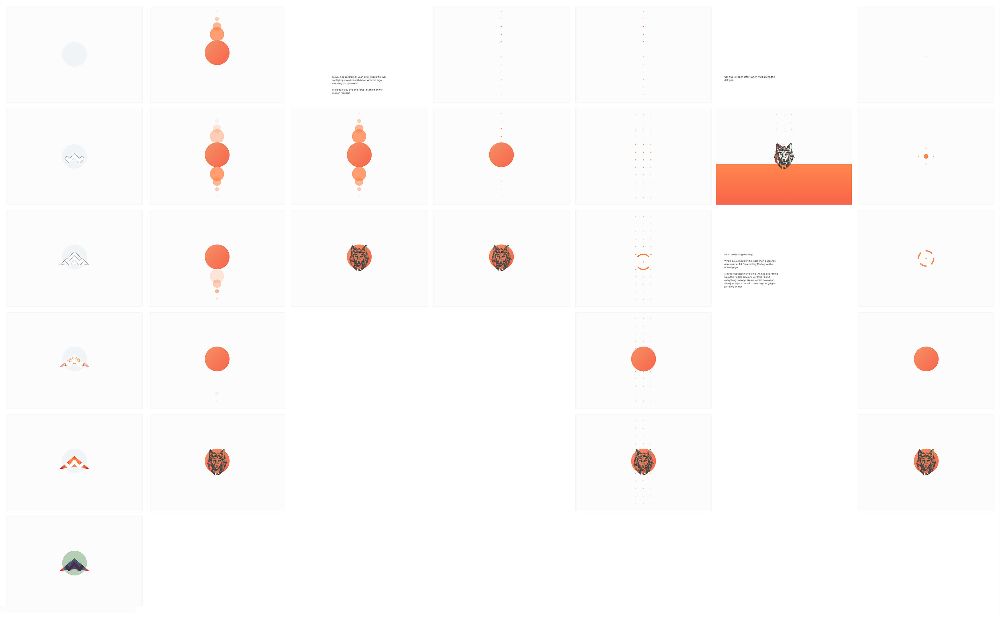

# Wolfpilot

Personal portfolio website using Next JS, sprinkled with Framer Motion animations and other goodies.

## Table of contents

- [Intro](#intro)
- [Demo](#demo)
- [Features (done)](#features-done)
- [Features (TBA)](#features-tba)
- [Technologies](#technologies)
- [Getting started](#getting-started)
- [License](#license)

## Intro

_Code & art, two sides of the same coin._

Nothing compares to the passion one has for a project of their own choice, and this one's mine.


## Demo

- Homepage: [https://www.wolfpilot.co/](https://www.wolfpilot.co/)
- Homepage w. debug grid: [https://www.wolfpilot.co/?debugGrid=true](https://www.wolfpilot.co/?debugGrid=true)
- Case Study Example: [http://localhost:3000/cases/cawr](http://localhost:3000/cases/cawr)
- Styleguide: [https://www.wolfpilot.co/styleguide](https://www.wolfpilot.co/cases)

## Features (done)

- Architecture

  - Next JS filename-based navigation

- State management

  - React Context

- UI & UX

  - Animated splash screen
  - Custom cursor
  - CSS blurred site header
  - Hue-changing mouse effect
  - Oil-spill animation and hover effects

- Accessibility

  - Fully-TAB navigable
  - Mobile site nav
    - ESC to close
  - Gallery modal
    - ESC to close
    - CTRL + <- / -> to go to prev/next slide
    - Click to zoom-in / out, scroll to pan around
  - Experience
    - Click to expand / collapse

- Config

  - Import path aliases using tsconfig-paths

- QOL (Quality of Life)

  - Debug visual grid
    - Add `debugGrid=true` param to any URL

## Features (TBA)

- [x] None (complete)

## Technologies

- Languages
  - [TypeScript](https://www.typescriptlang.org/)
- Framework
  - [Next.js](https://nextjs.org/)
  - [React](https://react.dev/)
- Config
  - [tsconfig-paths](https://www.npmjs.com/package/tsconfig-paths)
- Linting & formatting
  - [EsLint](https://eslint.org/)
  - [Prettier](https://prettier.io/)
- State management
  - [Context](https://react.dev/reference/react/createContext)
- Animation
  - [Framer Motion](https://www.framer.com/motion/)
- Testing
  - [RTL](https://testing-library.com/)
  - [Jest](https://jestjs.io/)
- CI/CD
  - [Husky](https://www.npmjs.com/package/husky)
    - Pre-commit
    - Pre-push
  - [Vercel](https://vercel.com/)
    - Hosting static webapp

### Splash Screen

Well, I'm not one to stroke my ego normally, but I'm very happy with this one!

As is the case with much of my work, I am constantly jumping between code and art, structure and flow, and this is yet another example of the same.

The idea was to show my general worflow. It's a multi-step animation, starting with a blank canvas and finishing with the delta-airplane shaped logo I have come to love so much. More exactly, the animation consists of three steps:

1. The sketch or drawing.
2. The gradual assembly or skeleton.
3. The textures, explosion of colour and impact.

This also creates an initial impression of the branding whose elements can later be seen throughout the site: the orange theme, oil-spill hue effect and, of course, the more artistic nature of my work.

Below is a recording of the logo animation at 25% speed.

<video width="100%" height="auto" controls autoplay loop muted>
  <source src="./docs/videos/logo-animation-slowmo.mp4" type="video/mp4">
</video>

And some ideas I had initially for the splash screen animation.



### Page Transitions

While the transitions between pages is not anything spectacular, I found that "wiping" away the content only to reveal the new one from underneath gives a break from the amount of information, colours and effects seen previously. Think of it as a break, a moment of rest in between musical acts or a calm scene following 20 minutes of non-stop action in your favourite movie.

When everything is busy, nothing stands out. An interruption in the rhythm makes a great impact.

On the more functional side, page transitions also allow data fetching or layout shifts to happen without janky UI movements. It's a nice way to keep the viewer interested and to hide unwanted visual artifacts.

## Getting started

### Requirements

- [Yarn](https://yarnpkg.com/) (built on v1.22.22)

### Installation

```bash
$ git clone https://github.com/wolfpilot/wolfpilot.github.io.git
$ cd wolfpilot.github.io
$ yarn
```

### Steps

```bash
# 1. Update your env config, see .env.sample for guidance.

# 2. Run a local server instance
$ yarn dev
```

## License

This project is licensed under the [MIT License](LICENSE).
